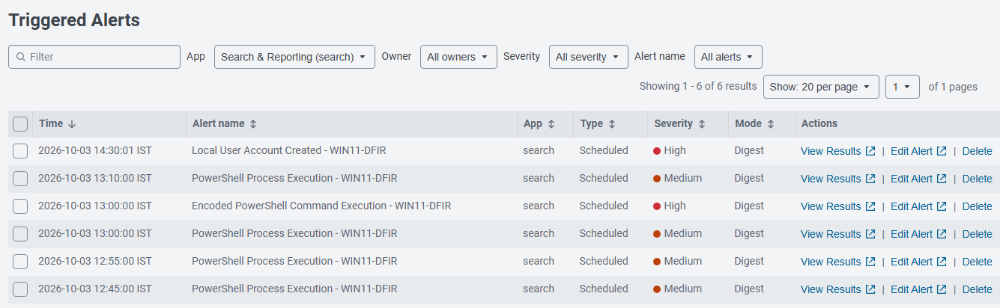
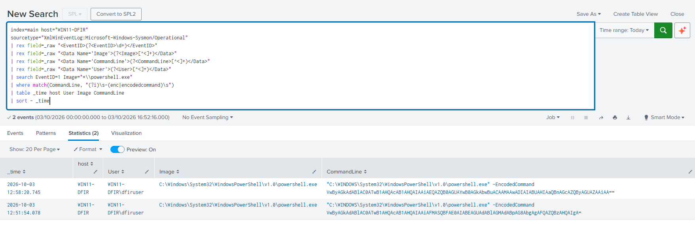
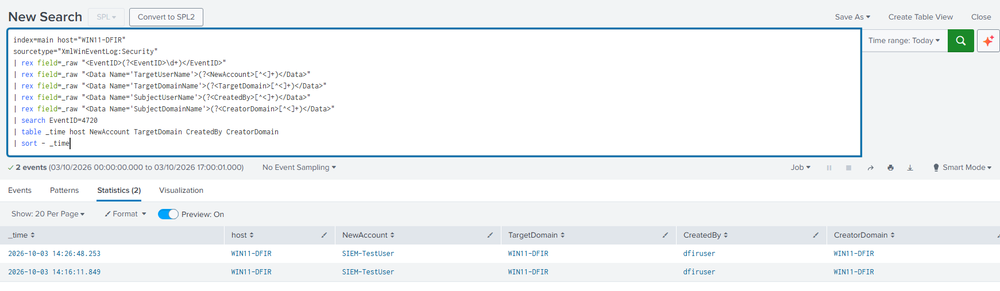

# SIEM Detection Engineering

## Overview

This section documents the initial detection rules developed and tested within the home SOC lab.

Rather than only creating saved searches, each detection was validated through controlled activity on WIN11-DFIR. The process included identifying the required telemetry, developing the SPL search, generating a known event, confirming ingestion and verifying that the scheduled alert triggered as expected.

The initial detection set consists of:

| Detection | Data Source | Severity |
|---|---|---|
| PowerShell Process Execution | Sysmon Event ID 1 | Medium |
| Encoded PowerShell Command Execution | Sysmon Event ID 1 | High |
| Local User Account Created | Windows Security Event ID 4720 | High |

All three detections currently run every five minutes and search the previous five-minute event window.

### Detection Testing Evidence

The following screenshot shows the alerts generated during controlled testing of the three detection rules.

[](../screenshots/splunk-triggered-alerts.png)

*Figure 1 - Splunk Triggered Alerts following controlled detection testing. The encoded PowerShell test triggered both the general PowerShell execution rule and the more specific encoded-command rule, demonstrating overlapping detection logic. The local account creation test independently triggered the Windows Security Event ID 4720 detection.*

---

## Detection 001 - PowerShell Process Execution

### Objective

Detect the creation of a Windows PowerShell process on the monitored endpoint.

This is intentionally a broad detection. Its purpose is to provide visibility into PowerShell execution and establish a baseline detection before introducing more specific command-line logic.

### Data Source

- **Host:** `WIN11-DFIR`
- **Source:** Sysmon
- **Event ID:** `1` - Process Create
- **Sourcetype:** `XmlWinEventLog:Microsoft-Windows-Sysmon/Operational`

### Detection Logic

The search extracts the Event ID, process image, command line and user from the raw Sysmon XML before filtering for `powershell.exe`.

```spl
index=main host="WIN11-DFIR"
sourcetype="XmlWinEventLog:Microsoft-Windows-Sysmon/Operational"
earliest=-5m
| rex field=_raw "<EventID>(?<EventID>\d+)</EventID>"
| rex field=_raw "<Data Name='Image'>(?<Image>[^<]+)</Data>"
| rex field=_raw "<Data Name='CommandLine'>(?<CommandLine>[^<]+)</Data>"
| rex field=_raw "<Data Name='User'>(?<User>[^<]+)</Data>"
| search EventID=1 Image="*\\powershell.exe"
| table _time host User Image CommandLine
| sort - _time
```

### Alert Configuration

- **Alert type:** Scheduled
- **Schedule:** Every 5 minutes
- **Search window:** Last 5 minutes
- **Trigger condition:** Number of results > 0
- **Trigger mode:** Once
- **Severity:** Medium

### Controlled Test

A new PowerShell process was launched on WIN11-DFIR to generate a known Sysmon Event ID 1.

The event was successfully forwarded to Splunk and matched the detection logic. The scheduled search subsequently generated an entry in Splunk Triggered Alerts.

### Analysis

The detection successfully provides visibility into PowerShell process execution, but it is deliberately broad. Legitimate administrative activity can generate the same telemetry, so the presence of `powershell.exe` alone should not be interpreted as malicious activity.

This rule therefore provides a useful monitoring baseline while more specific detections can examine command-line arguments or other behavioural indicators.

---

## Detection 002 - Encoded PowerShell Command Execution

### Objective

Detect PowerShell processes launched with encoded command-line arguments.

PowerShell supports encoded commands through parameters such as `-EncodedCommand` and its abbreviated form `-enc`. While encoded commands can be used legitimately, they can also obscure the content of a command and therefore provide a useful behaviour to monitor.

### Data Source

- **Host:** `WIN11-DFIR`
- **Source:** Sysmon
- **Event ID:** `1` - Process Create
- **Sourcetype:** `XmlWinEventLog:Microsoft-Windows-Sysmon/Operational`

### Detection Logic

The detection first identifies PowerShell process creation and then examines the command line for encoded-command parameters.

```spl
index=main host="WIN11-DFIR"
sourcetype="XmlWinEventLog:Microsoft-Windows-Sysmon/Operational"
earliest=-5m
| rex field=_raw "<EventID>(?<EventID>\d+)</EventID>"
| rex field=_raw "<Data Name='Image'>(?<Image>[^<]+)</Data>"
| rex field=_raw "<Data Name='CommandLine'>(?<CommandLine>[^<]+)</Data>"
| rex field=_raw "<Data Name='User'>(?<User>[^<]+)</Data>"
| search EventID=1 Image="*\\powershell.exe"
| where match(CommandLine, "(?i)\s-(enc|encodedcommand)\s")
| table _time host User Image CommandLine
| sort - _time
```

The regular expression is case-insensitive and detects both `-enc` and `-EncodedCommand`.

### Alert Configuration

- **Alert type:** Scheduled
- **Schedule:** Every 5 minutes
- **Search window:** Last 5 minutes
- **Trigger condition:** Number of results > 0
- **Trigger mode:** Once
- **Severity:** High

### Controlled Test

A benign PowerShell command was converted to Base64 and executed using the `-EncodedCommand` parameter:

```powershell
$cmd = 'Write-Output "Detection 002 Triggered"'
$encoded = [Convert]::ToBase64String([Text.Encoding]::Unicode.GetBytes($cmd))
powershell.exe -EncodedCommand $encoded
```

The command simply produced the expected text output while generating the telemetry required to test the detection.

Splunk captured the PowerShell process creation event and its encoded command line. Detection 002 subsequently appeared in Triggered Alerts.

[](../screenshots/encoded-powershell-detection.png)

*Figure 2 - Splunk search results from controlled encoded PowerShell testing. Sysmon Event ID 1 telemetry identifies the host, user, PowerShell executable and encoded command-line argument used during the test.*

### Detection Overlap

The same test also triggered **Detection 001 - PowerShell Process Execution**.

This occurred because the event satisfied both detection conditions:

1. A `powershell.exe` process was created.
2. The PowerShell command line contained an encoded-command parameter.

This demonstrated how a single underlying event can generate multiple alerts when detection logic overlaps.

### Analysis

Detection 002 is more specific than the general PowerShell execution rule because it evaluates command-line behaviour rather than process name alone.

However, encoded PowerShell should not automatically be classified as malicious. Legitimate administration and automation can also use encoded commands. In a larger monitoring environment, additional context and tuning would be required to distinguish expected activity from behaviour requiring investigation.

---

## Detection 003 - Local User Account Created

### Objective

Detect the creation of a local Windows user account on the monitored endpoint.

Account creation is an important security event to monitor because newly created accounts can represent legitimate administrative activity or an action requiring further investigation.

### Data Source

- **Host:** `WIN11-DFIR`
- **Source:** Windows Security Event Log
- **Event ID:** `4720` - A user account was created
- **Sourcetype:** `XmlWinEventLog:Security`

Unlike the first two detections, this rule uses the native Windows Security log rather than Sysmon telemetry.

### Detection Logic

The raw XML event is parsed to extract the newly created account and the user responsible for creating it.

```spl
index=main host="WIN11-DFIR"
sourcetype="XmlWinEventLog:Security"
earliest=-5m
| rex field=_raw "<EventID>(?<EventID>\d+)</EventID>"
| rex field=_raw "<Data Name='TargetUserName'>(?<NewAccount>[^<]+)</Data>"
| rex field=_raw "<Data Name='TargetDomainName'>(?<TargetDomain>[^<]+)</Data>"
| rex field=_raw "<Data Name='SubjectUserName'>(?<CreatedBy>[^<]+)</Data>"
| rex field=_raw "<Data Name='SubjectDomainName'>(?<CreatorDomain>[^<]+)</Data>"
| search EventID=4720
| table _time host NewAccount TargetDomain CreatedBy CreatorDomain
| sort - _time
```

### Alert Configuration

- **Alert type:** Scheduled
- **Schedule:** Every 5 minutes
- **Search window:** Last 5 minutes
- **Trigger condition:** Number of results > 0
- **Trigger mode:** Once
- **Severity:** High

### Controlled Test

A temporary local Windows account was created from an elevated PowerShell session:

```powershell
net user SIEM-TestUser "LabTest2026!" /add
```

Windows generated Security Event ID `4720`, which was forwarded to Splunk and matched the detection logic.

The resulting event identified both the newly created account and the account responsible for creating it. Detection 003 subsequently appeared in Splunk Triggered Alerts.

[](../screenshots/local-account-creation-detection.png)

*Figure 3 - Windows Security Event ID 4720 telemetry from controlled account-creation testing. SPL field extraction identifies the newly created account, target system and user responsible for creating the account.*

### Cleanup and Additional Validation

After testing, the temporary account was removed:

```powershell
net user SIEM-TestUser /delete
```

The deletion generated Windows Security Event ID `4726`, which was also successfully observed in Splunk.

No separate alert was created for account deletion during this phase, but the event confirmed that additional account lifecycle telemetry was being collected successfully.

### Analysis

This detection expanded the monitoring environment beyond Sysmon process telemetry by introducing the Windows Security Event Log as a second security data source.

It also demonstrated the value of extracting contextual fields from raw events. Rather than simply identifying that Event ID 4720 occurred, the resulting detection output shows which account was created and which user initiated the action.

---

## Lessons from Detection Testing

Building and testing the initial detection set highlighted several practical aspects of SIEM monitoring:

- **Logging and detection are separate stages.** An event can be successfully generated, forwarded and indexed without necessarily triggering an alert if it falls outside the scheduled search window.
- **Detection specificity affects alert volume.** The general PowerShell rule provides broad visibility, while the encoded-command rule identifies a narrower behaviour of interest.
- **One event can trigger multiple detections.** The encoded PowerShell test matched both the general and specific PowerShell rules, demonstrating the need to consider alert overlap and correlation.
- **Multiple telemetry sources provide different visibility.** Sysmon supplied detailed process-creation information, while the Windows Security log provided account-management events such as Event IDs 4720 and 4726.
- **Raw telemetry often requires transformation.** Extracting useful fields from the XML events with SPL made the resulting alerts easier to interpret and investigate.

These initial detections establish a working baseline for the lab. Future detection-engineering exercises can build on this foundation with additional telemetry, more specific behavioural logic, ATT&CK mapping and alert tuning.
